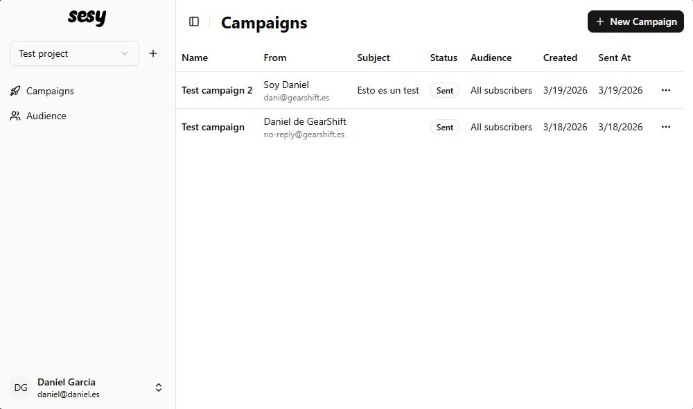
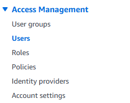
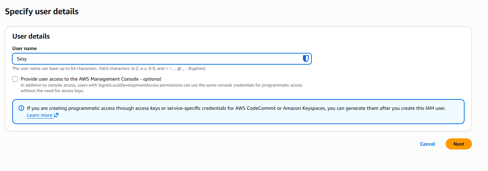
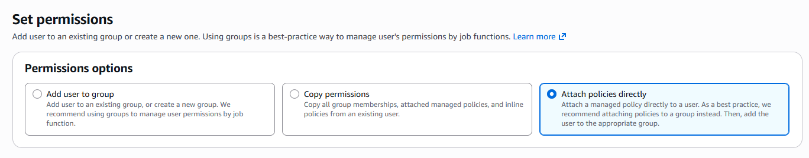
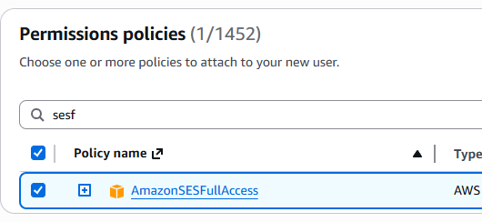
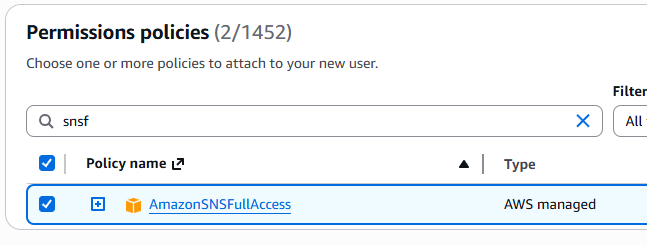
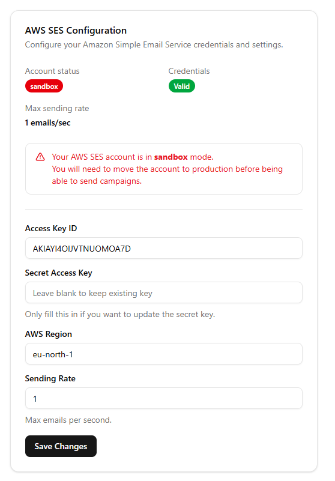
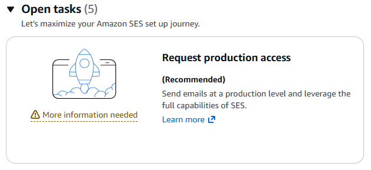

  
  

**Send and manage email campaigns easily with Sesy, an AWS SES wrapper.**

> ⚠️ This tool is still in beta!

## Roadmap

- [x] Configure AWS SES fully from the app
- [x] Adding audience members via API
- [ ] Onboarding flow on first deployment
- [ ] [Poka-Yoke] Prevent sending campaigns if the SES configuration or domain are not set and valid
- [ ] Campaign statistics (SES Events webhook)
- [ ] Batch audience member edits

## Getting started

> ⚠️ You will need a production ready SES AWS account

1. Copy the `docker-compose.yml` in the root of this repo
2. Change the environment variables in the compose file to fit your domain
3. Run `docker compose up -d`
4. The app should be accessible at `localhost:80`
5. Login with username `admin` and password `admin`, you will be able to change these in the app's settings.

## Setup your AWS SES account

1. Sign up for an AWS account [here](https://portal.aws.amazon.com/billing/signup).

2. Once in the console, search for "IAM" at the top left searchbar and click on IAM

   

3. In the left bar click on "Users"

   

4. Click on "Create user" at the top right

   

5. Name the user whatever you like

   

6. In the next window, select "Attach policies directly"

   

7. Then in Permissions policies search and check `AmazonSESFullAccess` and `AmazonSNSFullAccess`, then hit "next"

   
   

8. Hit "Create user"

9. Once created, click on the created user

   

10. Go to "Security credentials"

11. Create access key

    

12. Once created copy the access and secret keys and paste them in the AWS SES settings of your Sesy instance.

    Select the AWS region you like.

    

13. Your account will probably be in sandbox (test) mode.

    You will need to submit a request with some details of what you will be using it for in the AWS SES console

    

14. You can check periodically in your Sesy settings for the status of the account. AWS will also notify you. In the meantime, you can start importing your audience in the audience tab.
