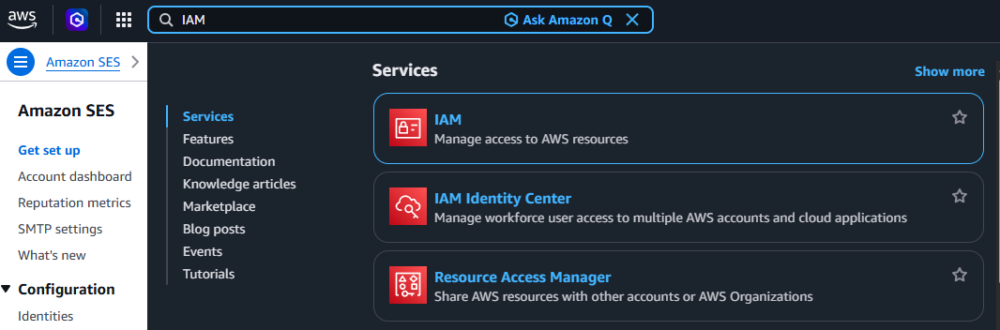
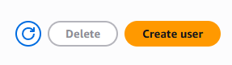
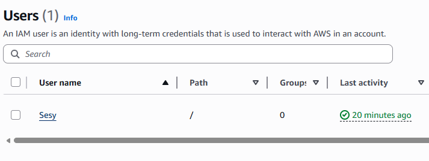
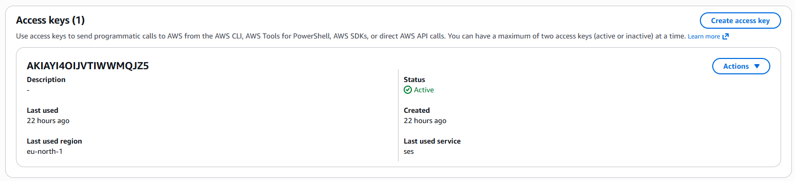

## Setting Up AWS SES

### 1. Create an IAM User

1. Sign up for an AWS account [here](https://portal.aws.amazon.com/billing/signup)
2. In the AWS console, search for **IAM** and open it

   

3. In the left sidebar, click **Users**

   

4. Click **Create user** in the top right

   

5. Give the user any name you like

   

6. On the permissions screen, select **Attach policies directly**

   

7. Search for and attach both `AmazonSESFullAccess` and `AmazonSNSFullAccess`, then click **Next**

   
   

8. Click **Create user**

### 2. Generate Access Keys

9. Click on the newly created user

   

10. Go to the **Security credentials** tab
11. Click **Create access key**

    

12. Copy the **Access Key** and **Secret Key**, then paste them into the AWS SES settings page in your Sesy instance. Select your preferred AWS region.

    

### 3. Request Production Access

13. New AWS accounts start in SES sandbox mode (you can only send to verified addresses). Submit a production access request through the AWS SES console.

    

14. AWS will email you when approved. This usually takes a few hours to a day. In the meantime, you can start importing your audience in the **Audience** tab.